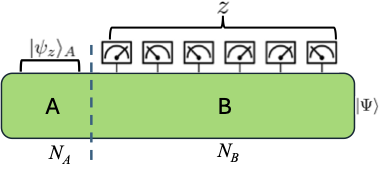
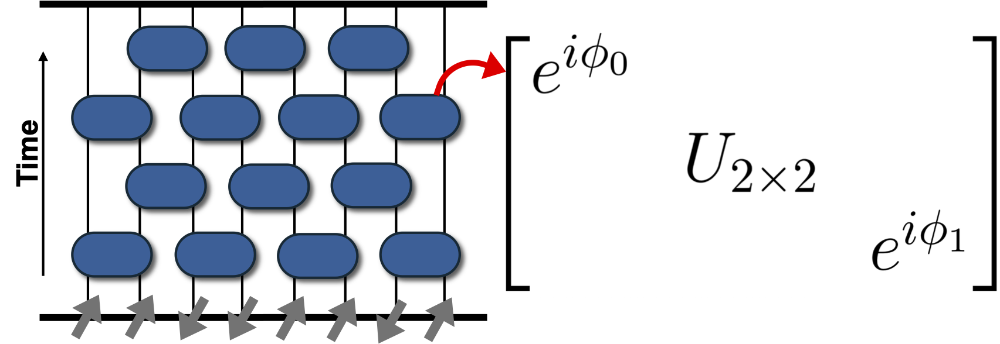

# 🔬 Deep Thermalization in U(1)-Symmetric Random Circuits

High-performance Python simulations for studying symmetry-constrained quantum many-body dynamics, subsystem equilibration, and projected ensemble universality.

Based on:

> R.-A. Chang et al.,  
> *Deep Thermalization under Charge-Conserving Quantum Dynamics*,  
> PRX Quantum 6, 020343 (2025)

---

# 🧠 What Is a Projected Ensemble?

In modern quantum simulators, we can measure the environment of a subsystem rather than tracing it out.

Instead of only studying the reduced density matrix ρ_A,  
we condition on measurement outcomes of the environment B.

This generates a **projected ensemble** —  
an ensemble of pure states on subsystem A, weighted by measurement probabilities.

### System setup



Subsystem A interacts with environment B.  
After measuring B, we obtain conditional pure states on A.

This framework goes beyond standard thermalization by analyzing the *full distribution* of subsystem states rather than only expectation values.

---

# 🌊 What Is Deep Thermalization?

Deep thermalization refers to the emergence of **universal projected ensembles** in chaotic quantum dynamics.

In symmetry-free systems:
- The projected ensemble approaches the Haar distribution.

With conservation laws (e.g., U(1) charge conservation):
- The limiting ensemble acquires structured universal forms.
- Only coarse-grained conserved quantities determine equilibrium statistics.
- Microscopic circuit details become irrelevant.

This work studies how U(1) symmetry modifies deep thermalization.

---

# ⚙️ Model: U(1)-Symmetric Random Circuits

We simulate charge-conserving random quantum circuits:



Key features:

- Two-site unitary gates
- Exact U(1) charge conservation
- Random circuit architecture
- Large bath limit

This architecture models:

- Symmetry-preserving quantum hardware
- Analog quantum simulators
- Charge-conserving superconducting qubit circuits

---
# 📊 Example Result: Finite-Size Scaling of Projected Ensemble Convergence


**Trace-norm distance to the universal projected ensemble** as a function of circuit depth for different system sizes.

Key observations:

- The distance decays rapidly in time under U(1)-symmetric chaotic dynamics.
- A finite late-time plateau appears due to finite-size effects.
- The late-time average scales as a power law in system size (inset).

This demonstrates quantitatively that:

- The projected ensemble approaches its universal limit.
- Finite-size corrections shrink systematically with increasing N.
- Symmetry-constrained dynamics still exhibit universal equilibration.

Such finite-size scaling analysis is directly relevant for benchmarking symmetry-preserving quantum processors, where conservation laws constrain accessible Hilbert space growth.


# 📊 Main Results

## 1️⃣ Universal Limiting Ensembles

We show that projected ensembles converge to a generalized universal form determined only by:

- Initial charge distribution
- Measurement basis statistics

This demonstrates a symmetry-aware extension of standard thermalization.

---

## 2️⃣ Finite-Size Scaling & Classical Simulability

We perform large-scale simulations (up to 24 qubits) and analyze:

- Trace-norm distance to limiting ensemble
- Finite-size scaling of convergence
- Hilbert-space growth under symmetry constraints

This provides quantitative insight into:

- When classical simulation remains efficient
- How conservation laws alter scrambling dynamics
- Scaling toward potential quantum advantage

---

## 3️⃣ High-Performance Simulation Framework

Implemented in Python with:

- Charge-sector-resolved Hilbert space decomposition
- Efficient tensor contractions
- Monte Carlo sampling
- Parallelized HPC workflows (Slurm-based)

Designed for scalability and reproducibility.

---

# 🔎 Relevance to Quantum Hardware & Industry

Conservation laws are intrinsic to physical quantum systems.

Understanding symmetry-constrained dynamics is relevant for:

- Hardware benchmarking under physical constraints
- Diagnosing scrambling and equilibration
- Designing symmetry-aware algorithms
- Identifying classical-to-quantum crossover regimes

This repository provides a classical simulation platform for studying these effects quantitatively.

---

# 🏗 Repository Structure

```
src/                # Core simulation code
figures/            # Diagrams and result plots
notebooks/          # Analysis scripts (optional)
README.md
```

---

# 👤 Author

Rui-An (Ryan) Chang  
PhD Candidate in Quantum Information Science  
University of Texas at Austin  

Publication: PRX Quantum (2025)

---

# 📌 Outlook

Future extensions include:

- Noise-aware symmetry diagnostics
- Operator growth and magic under conservation laws
- Benchmarking protocols for hardware-constrained architectures
- Large-scale simulation with GPU acceleration

---
