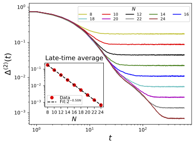

# 🔬 Deep Thermalization in U(1) Random Circuits  
### High-Performance Simulation Framework for Symmetry-Constrained Quantum Dynamics

---

## 📌 Overview

This repository contains high-performance Python simulations for studying the projected ensemble in a subsystem converges to a universal limiting ensemble in U(1)-symmetric quantum circuits.

This project is based on:

> R.-A. Chang, H. Shrotriya, W. W. Ho, and M. Ippoliti,  
> **Deep Thermalization under Charge-Conserving Quantum Dynamics**,  
> PRX Quantum 6, 020343 (2025)

We introduce and numerically validate the concept of **deep thermalization** — the emergence of universal limiting ensembles in symmetry-conserving many-body dynamics.

This framework provides:

- Classical simulations for the subsystem dynamics in U(1)-symmetric (charge-conserving) random circuits -- the convergence to universal limiting ensembles
- Scaling analysis for deep thermalization 
- Quantitative diagnostics of subsystem equililibration  

---

## 🚀 Relevance to Quantum Hardware & Industry

Some modern quantum processors operate under physical conservation laws. For example, neutral atom systems operate with charge (number) conservation.

Understanding:

- How symmetries affect scrambling  
- When projected ensembles become universal  

is directly relevant to:

- Quantum benchmarking  
- Noise-aware algorithm design  
- Identifying regimes of potential quantum advantage  

This repository provides a classical simulation platform to study those effects quantitatively.

---

## 🧠 Core Contributions

### 1️⃣ Symmetry-Constrained Thermalization

We demonstrate that in U(1)-conserving chaotic circuits:

- Projected subsystem ensembles converge to universal distributions  
- The limiting ensemble depends only on coarse-grained charge statistics  
- Microscopic circuit details become irrelevant at late time  

This reveals a symmetry-modified extension of standard quantum thermalization.

---

### 2️⃣ High-Performance Numerical Simulations

Implemented scalable simulations featuring:

- Charge-sector-resolved Hilbert space decomposition  
- Efficient tensor contractions  
- Large-scale Monte Carlo sampling  
- Parallel execution on HPC clusters (Slurm workflows)  

Simulations reach:

- Up to 24 qubits  
- Trace-norm convergence below 10⁻³  
- Finite-size scaling of computational cost  

---

### 3️⃣ Quantitative Classical Benchmarking

We analyze:

- Trace-norm distance to universal limiting ensembles  
- Finite-size scaling of computational cost  
- Hilbert-space growth under symmetry constraints  

This enables defining quantitative baselines for:

> When classical simulation becomes intractable under symmetry constraints.

---

## 📊 Example Results

(Create a folder named `figures/` and place your plots inside it.)

```markdown
### Projected Ensemble Convergence


Trace-norm distance to the universal limiting ensemble decreases with circuit depth.
The late-time average approaches to zero as system size increases.
```


## 🏗 Technical Stack

- Python  
- NumPy / SciPy  
- Parallel computing (Slurm HPC workflows)  
- Tensor contraction methods  
- Monte Carlo sampling  
- Data analysis & visualization  

---

## 📂 Repository Structure

```
src/                # Core simulation code
figures/            # Generated plots
notebooks/          # Analysis scripts (optional)
README.md
```

---

## 🔎 Research Context

Deep thermalization extends conventional quantum thermalization by studying the full projected ensemble rather than only reduced density matrices.

We show that:

- U(1) symmetry induces structured universal ensembles  
- Only polynomial data (charge distributions) determine equilibrium statistics  
- Projected ensembles form generalized Scrooge ensembles  

This provides a symmetry-aware extension of random-state universality.

---

## 👤 Author

Rui-An (Ryan) Chang  
PhD Candidate in Quantum Information Science  
University of Texas at Austin  

Publication: PRX Quantum (2025)

---

## 📌 Future Directions

This framework can be extended toward:

- Noise-aware operator growth diagnostics  
- Magic growth under symmetry constraints  
- Hardware benchmarking for superconducting qubits  
- Identifying classical-to-quantum computational crossover  

---
